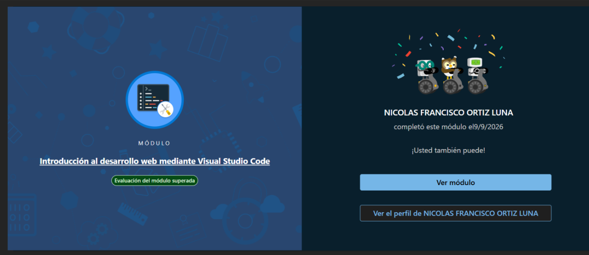

# EjercicioHTML
Ejercicio de practica de HTML, CSS y Javascript basico. El objetivo era crear una pagina con un titulo, una lista, un boton para cambiar de tema y un boton para cambiar de pagina.

https://learn.microsoft.com/es-es/training/modules/get-started-with-web-development/

COMPLETADO:

https://learn.microsoft.com/api/achievements/share/es-es/NICOLASFRANCISCOORTIZLUNA-0163/3ZTX256H?sharingId=FD96CA84480F37B6

